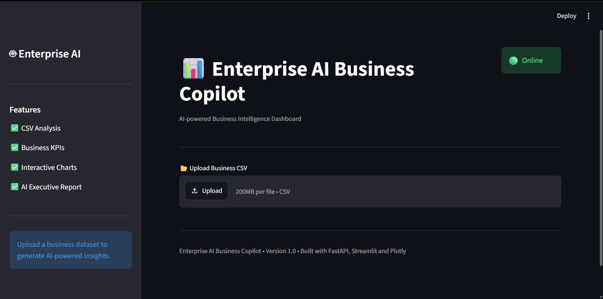
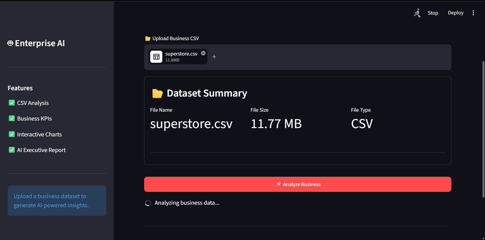
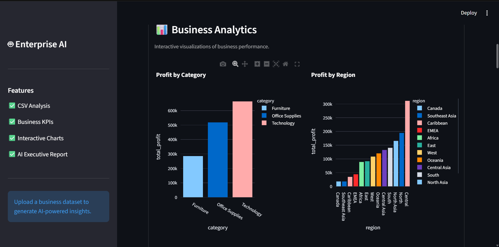
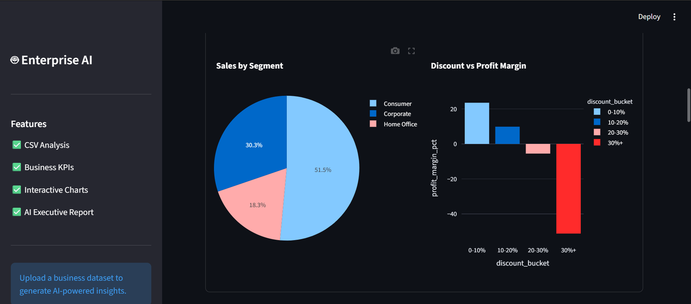
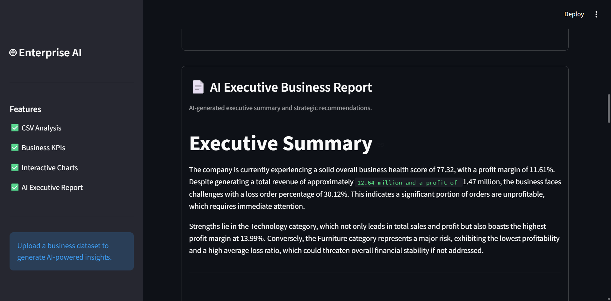
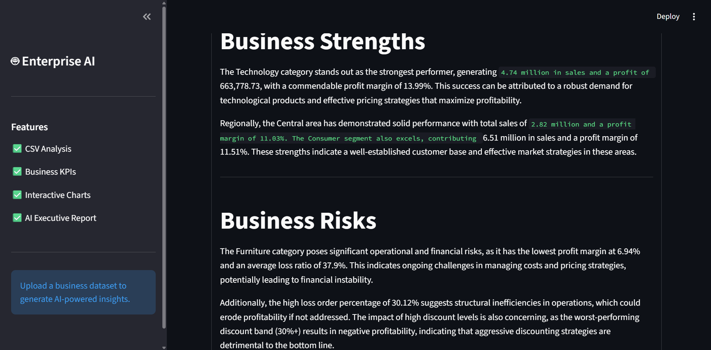
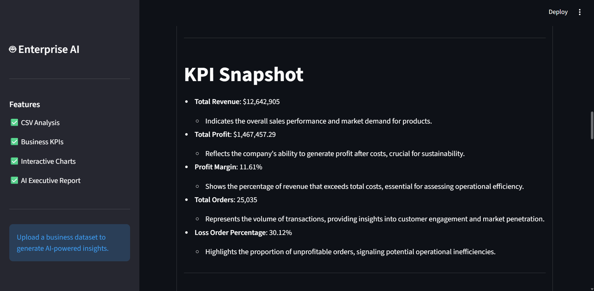
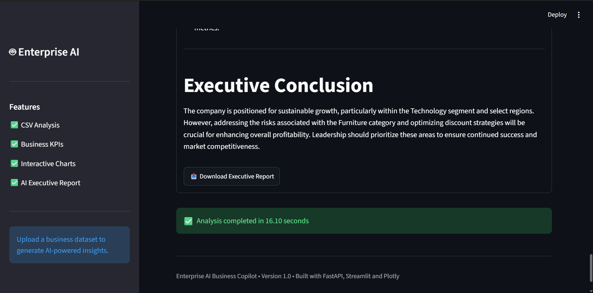

# 📊 Enterprise AI Business Copilot

An AI-powered Business Intelligence platform that transforms raw business CSV data into executive-level insights, interactive dashboards, and AI-generated strategic recommendations.

Built with **FastAPI**, **Streamlit**, **Plotly**, and **Python**, this project demonstrates an end-to-end AI application combining backend engineering, business analytics, and modern dashboard development.

---

## 🚀 Live Demo

🔗 **Frontend:** http://localhost:8501/

🔗 **Backend API:** http://127.0.0.1:8000/docs

---

# 📸 Screenshots

## Dashboard




---

## Business Analytics



---

## AI Executive Report



---

# ✨ Features


## 📂 CSV Upload

- Upload business datasets
- Automatic validation
- FastAPI backend processing

---

## 📈 Business KPI Dashboard

Automatically calculates:

- Total Revenue
- Total Profit
- Profit Margin
- Business Health Score
- Total Orders
- Loss Order Percentage

---

## 📊 Interactive Business Analytics

Visualizations include:

- Profit by Category
- Profit by Region
- Sales by Segment
- Discount vs Profit Margin

Built using Plotly.

---

## 🤖 AI Executive Business Report

Generates an executive-level report including:

- Executive Summary
- KPI Snapshot
- Business Strengths
- Business Risks
- Growth Opportunities
- Strategic Recommendations
- 30-60-90 Day Action Plan
- Executive Conclusion

---

## 📥 Report Export

Download the AI-generated report as Markdown.

---

## ⏱ Performance Metrics

Displays total analysis execution time.

---

# 🏗 System Architecture

```
                CSV Upload
                     │
                     ▼
        Streamlit Dashboard
                     │
                     ▼
          FastAPI REST API
                     │
                     ▼
      Business Analytics Engine
                     │
                     ▼
        KPI Calculation Engine
                     │
                     ▼
       AI Executive Report Engine
                     │
                     ▼
          JSON API Response
                     │
                     ▼
      Interactive Dashboard
```

---

# 📂 Project Structure

```text
Enterprise-AI-Business-Copilot/
│
├── app/
│   ├── api/
│   │   └── v1/
│   │       └── routes.py
│   │
│   ├── core/
│   │   └── config.py
│   │
│   ├── schema/
│   │   └── response.py
│   │
│   ├── services/
│   │   └── analysis_service.py
│   │
│   ├── utils/
│   │   └── json_utils.py
│   │
│   └── main.py
│
├── dashboard/
│   ├── app.py
│   ├── api.py
│   │
│   └── components/
│       ├── header.py
│       ├── sidebar.py
│       ├── dataset_summary.py
│       ├── metrics.py
│       ├── charts.py
│       ├── report.py
│       ├── download.py
│       ├── timer.py
│       └── footer.py
│
├── data/
│
├── requirements.txt
│
└── README.md
```

---

# 🛠 Tech Stack

## Backend

- FastAPI
- Pandas
- NumPy
- Pydantic
- Uvicorn

---

## Frontend

- Streamlit
- Plotly

---

## AI & Analytics

- Python
- Business KPI Engine
- Executive Report Generator

---

# ⚙ Installation

## Clone Repository

```bash
git clone https://github.com/yourusername/enterprise-ai-business-copilot.git

cd enterprise-ai-business-copilot
```

---

## Install Dependencies

```bash
pip install -r requirements.txt
```

---

## Run Backend

```bash
uvicorn app.main:app --reload
```

Backend:

```
http://127.0.0.1:8000
```

Swagger Docs:

```
http://127.0.0.1:8000/docs
```

---

## Run Dashboard

```bash
streamlit run dashboard/app.py
```

Dashboard:

```
http://localhost:8501
```

---

# 📖 API Endpoints

## Health Check

```
GET /api/v1/health
```

Response

```json
{
    "status": "ok",
    "version": "1.0.0"
}
```

---

## Analyze Business Dataset

```
POST /api/v1/analyze
```

Input

```
CSV File
```

Returns

- KPIs
- Analytics
- Executive Report

---

# 💼 Business Metrics Generated

The analytics engine automatically computes:

- Revenue
- Profit
- Profit Margin
- Business Health Score
- Category Performance
- Regional Performance
- Segment Analysis
- Discount Impact
- Structural Business Risks
- Growth Opportunities

---

# 🎯 Future Improvements

- PDF Export
- Excel Export
- Authentication
- User Login
- Cloud Storage
- Database Support
- Multiple Dataset Comparison
- AI Chat with Business Data
- Forecasting Dashboard
- Predictive Analytics
- Multi-tenant Architecture

---

# 📚 What I Learned

This project strengthened my understanding of:

- FastAPI Architecture
- REST API Design
- Business Analytics
- Data Visualization
- Dashboard Development
- Modular Software Architecture
- Backend-Frontend Communication
- JSON Serialization
- Error Handling
- Clean Code Principles

---

# 🎓 Resume Highlights

- Designed and developed an AI-powered Business Intelligence platform using FastAPI and Streamlit.
- Built a modular analytics engine to calculate KPIs, business health scores, and strategic insights from CSV datasets.
- Developed an interactive dashboard with Plotly visualizations and AI-generated executive reports.
- Implemented clean backend architecture, REST APIs, JSON serialization, and reusable frontend components.

---

# 🤝 Contributing

Contributions are welcome!

Feel free to fork the repository, open issues, or submit pull requests.

---

# 📄 License

This project is licensed under the MIT License.

---

# 👨‍💻 Author

**Mohit Kumar**

LinkedIn: www.linkedin.com/in/37-mohitkumar

GitHub:https://github.com/Shivacode-37

Email: 37mohitkumar.mk@gmail.com.com

---

⭐ If you found this project useful, consider giving it a star!
